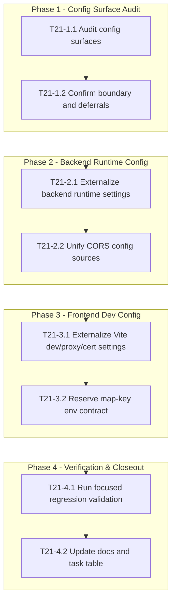

# T21 Dependency Graph

```mermaid
flowchart TD
    subgraph P1[Phase 1 - Config Surface Audit]
        T211[T21-1.1 Audit config surfaces] --> T212[T21-1.2 Confirm boundary and deferrals]
    end

    subgraph P2[Phase 2 - Backend Runtime Config]
        T221[T21-2.1 Externalize backend runtime settings] --> T222[T21-2.2 Unify CORS config sources]
    end

    subgraph P3[Phase 3 - Frontend Dev Config]
        T231[T21-3.1 Externalize Vite dev/proxy/cert settings] --> T232[T21-3.2 Reserve map-key env contract]
    end

    subgraph P4[Phase 4 - Verification & Closeout]
        T241[T21-4.1 Run focused regression validation] --> T242[T21-4.2 Update docs and task table]
    end

    T212 --> T221
    T222 --> T231
    T232 --> T241
```
