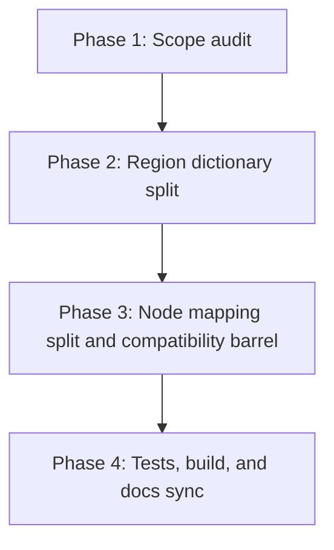

# T22 Dependency Graph

```mermaid
graph TD
  P1[Phase 1: Scope audit] --> P2[Phase 2: Region dictionary split]
  P2 --> P3[Phase 3: Node mapping split and compatibility barrel]
  P3 --> P4[Phase 4: Tests, build, and docs sync]
```

## Parallel Lane Note

T22 is a low-risk single-lane task. The shared entry file makes parallel edits unnecessary, so the task was executed sequentially.
