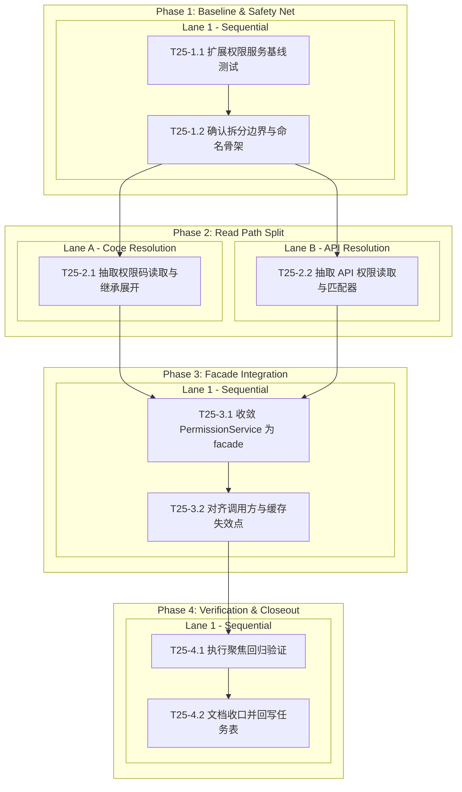

# T25 依赖图

```mermaid
graph TD
    subgraph P1[Phase 1: Baseline & Safety Net]
        subgraph P1L1[Lane 1 - Sequential]
            T2511[T25-1.1 扩展权限服务基线测试] --> T2512[T25-1.2 确认拆分边界与命名骨架]
        end
    end

    subgraph P2[Phase 2: Read Path Split]
        subgraph P2L1[Lane A - Code Resolution]
            T2521[T25-2.1 抽取权限码读取与继承展开]
        end
        subgraph P2L2[Lane B - API Resolution]
            T2522[T25-2.2 抽取 API 权限读取与匹配器]
        end
    end

    subgraph P3[Phase 3: Facade Integration]
        subgraph P3L1[Lane 1 - Sequential]
            T2531[T25-3.1 收敛 PermissionService 为 facade] --> T2532[T25-3.2 对齐调用方与缓存失效点]
        end
    end

    subgraph P4[Phase 4: Verification & Closeout]
        subgraph P4L1[Lane 1 - Sequential]
            T2541[T25-4.1 执行聚焦回归验证] --> T2542[T25-4.2 文档收口并回写任务表]
        end
    end

    T2512 --> T2521
    T2512 --> T2522
    T2521 --> T2531
    T2522 --> T2531
    T2532 --> T2541
```

## 说明

- Phase 2 的 Lane A / Lane B 在理论上可以并行，但共享 `security` 包上下文，合并风险为 **Medium**。
- 在未获得用户明确授权使用子代理前，默认顺序执行。
