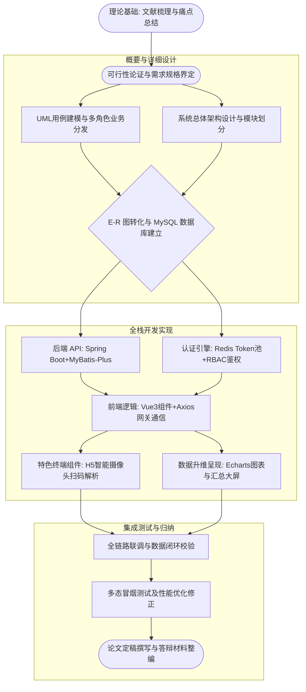

# 毕业设计（论文）开题报告

**论文题目：** 基于Spring Boot的工业企业配件供应链溯源系统的设计与实现

---

## 一、课题背景、目的及意义

### 1. 选题背景
随着工业数字化转型的不断深入，我国制造业正加速向数字化、智能化转型。工业企业对供应链精细化管理和全过程可追溯能力提出了更高要求。工业配件作为机械设备的核心基础，其质量直接决定了最终产品的可靠性，尤其在装备制造、汽车零部件、机械加工等行业，配件来源复杂、流转环节多、库存分散，一旦发生质量问题或供应链异常，往往难以快速定位问题源头，导致企业成本增加、信誉受损。
近年来，国家在质量安全与供应链透明化方面持续加强政策引导，工业和信息化部、商务部等部门先后发布《基于工业互联网的供应链创新与应用白皮书》《加快数智供应链发展专项行动计划》，明确要求构建“源头可溯、去向可追、问题可查、风险可控”的数字化供应链体系。配件溯源已成为汽车、航空、装备制造等行业的刚性需求，可有效解决责任难追溯等问题，推动供应链韧性提升。

### 2. 国内外研究现状
当前国内外关于供应链溯源系统的研究已取得显著进展，研究焦点主要集中在溯源数据的可信安全机制、底层物联网（IoT）数据采集技术以及跨企业信息管理平台的建设。总体来看，国外研究较多聚焦于技术架构的前沿性与信任机制计算，而国内研究则更注重系统应用实践与行业的快速落地。
国内研究主要集中在三个维度：第一是系统实现基础，国内学者在设计溯源管理平台时，多采用成熟的Java Web技术（如SSM架构逐渐向Spring Boot架构迁移），重点探讨业务流转、模块划分等；第二是基于赋码的溯源技术，多围绕二维码/RFID标签等载体建立生产品控与流转信息绑定机制，以实现产品全生命周期的数据追踪；第三是行业应用偏好，目前国内大部分落地的溯源系统集中在食品安全、农产品溯源（如冷链物流）及医药追溯，但对工业非标或标配零件特别是面向制造工厂内部及上下游协同的专用适配系统研究相对较少，系统交互多局限于传统PC端报表。
国外在工业供应链体系上起步早、探索深。近年来，国外研究更强调利用分布式账本（如区块链）来界定公共信任和防伪，然而这些重型架构对服务器资源消耗大，且定制化成本高昂，在具体的单一工业企业（尤其是中小规模）实践中，这些复杂技术往往因为算力开销过大、实施周期长而缺乏操作性；然后是新兴技术融合探讨，国外学术界近年来引入大数据分析与预测模型提升管理效率。
综上所述，国内外研究均具有较高的学术与实践价值，当前供应链溯源研究虽取得一定成果，但仍存在一些不足，大型系统成本高、实施周期长，不适合中小企业快速部署；二是部分轻量级研究仅停留在理论模型，缺乏前后端分离的现代化架构实践，尤其是在结合前端数据可视化与移动端便捷扫码接入方面存在体验断层。并且针对工业企业内部配件全流程溯源系统的完整设计与实现研究仍较为不足，尤其是在结合Spring Boot框架进行系统分层架构设计、RBAC权限模型构建以及流转数据可视化展示方面，仍有较大的研究与实践空间。因此，本课题具有一定的研究价值与现实意义。

### 3. 研究目的
本课题旨在设计并实现一套基于Spring Boot的轻量级工业企业配件供应链溯源系统，通过信息化手段彻底打通工业配件的完整数据闭环。具体要解决的问题与目标包括：
①系统架构与功能模块设计： 明确不同角色的业务边界，设计系统总体架构与功能模块结构；
②打破信息孤岛： 构建标准化数据模型，实现多环节数据的实时流转记录；
③构建“一物一码”身份锚点： 为工业配件定义系统内的唯一标识，并利用摄像头智能扫码技术，使工业现场操作工人能快速地完成关键节点的数据采集；
④建立强安全的权限模型： 构建基于角色的权限控制模型，实现基于RBAC的细粒度权限控制与Redis的Token强效防御机制，确保多角色（系统管理员、仓储管理员等）各司其职，屏蔽越权操作；
⑤提升系统拓展性： 提升系统可维护性与扩展性，为工业企业数字化管理提供参考方案。

### 4. 研究意义
在理论方面，本研究从系统工程角度出发，将信息系统工程理论与现代工业全生命周期流转业务深度融合，系统阐述了工业企业供应链溯源系统的整体设计与实现过程，有助于丰富企业级信息管理系统设计方法研究，进一步丰富轻量级后端架构与现代化前端框架在传统工业供应链领域的应用模型，为后续工业互联网应用提供一套具备高扩展性的架构参考。同时，通过引入基于角色的权限控制模型（RBAC），为多角色协同管理系统提供实践案例。
在实践方面，本系统能够实质性地帮助制造业企业以低成本实现配件数字资产化；帮助工业企业实现配件流转全过程可视化管理，提高溯源信息捕获的准确率及效率；在出现残次品时，可精确执行“溯源回查”或“批次追踪”，极大降低了问题排查的经济损耗与时间成本，为实体经济“数智化”提供了一条极具操作性的落地技术路径。

---

## 二、课题主要内容

本系统将目标拆解为四大核心业务模块进行设计与开发，共同构成一套健壮的工业级流转生态链：

1. **统一安全认证与角色权限模块（RBAC）**
   - 划分企业内部多级角色（系统管理员、生产发料员、质检员、仓管员等）的业务权限，建立“用户-角色-权限”的RBAC访问控制机制。
   - 开发动态路由与细粒度到按钮级的操作许可架构。
   - 融合 JWT 与 Redis 技术，实现安全登录校验、Token实时管控与黑名单强制下线功能，构筑坚实的底层安全防线。

2. **工业配件基础主数据管理模块**
   - 实现配件品类、规格参数、批次号等主数据的档案建立与规范化管理。
   - 开发独立的配件标识生成器，为生产或入库的每个配件分配具有全局唯一性的识别码（Part Code），奠定全链路溯源的基础锚点。

3. **核心溯源链条生命周期与智能采集模块**
   - 设计完整的多节点“状态机”管理模型，忠实记录每次环节流转（如“入库质检”、“产线领料”、“组装消耗”等）的发起人、时间戳与地理位置信息。
   - 重点开发适配便携式终端与网页端的H5摄像头扫码识别模块，替代传统的手动键盘录入，实现工业现场数据的高效、无缝采集，并支持一键正向查询与逆向追溯。

4. **全局供应链数据可视化看板模块**
   - 集成 Echarts 图表库与地理信息组件，提供大屏级别的数据监控平台。
   - 动态分析供应链的核心指标：如不同配件品种库存占比、特定流转节点的业务量统计及溯源异常数据的预警提示，辅助企业决策层宏观把控供应链健康度。

---

## 三、可行性分析

### 1. 技术可行性
本课题采用目前主流且极其成熟的B/S开发技术栈。后端采用 `Spring Boot 3` 框架配合 `MyBatis-Plus` 构建高并发、低耦合的 RESTful API；数据持久层依托 `MySQL`，并辅以 `Redis` 承载权限缓存与安全校验，保障系统响应速度。前端则选用现代化的 `Vue 3` 并配合 `Tailwind CSS` 进行响应式界面构筑。硬件扫码解析则直接应用兼容性良好的H5 Camera API。整个架构组合的社区支持与开源生态极度活跃，开发中涉及的各类拓展组件都有充足的使用文档。从架构落地到代码实现的整套链路均有坚实的技术保障，因此在技术层面完全可行。

### 2. 经济与时间可行性
本项目性质为轻量级前后端分离系统。开发使用的全部核心工具软件（如 IntelliJ IDEA、VS Code、Postman等）、框架及数据库系统均来自于免费的开源社区版本，无需支付昂贵的商业授权费用。由于采用终端摄像头扫码替代了传统的射频采集终端，为最终企业使用者免除了购置专用PDA的硬件负担，具有极佳的经济效益表现。在时间维度上，课题目标明确、模块粒度划分合理，在毕业设计的周期内，能够有序地完成从需求分析、系统构建到测试联调的全部工作，时间规划具备可行性。

### 3. 操作可行性
系统基于 Web 浏览器运行，无论用户使用个人计算机、平板还是智能手机，均可免安装直接访问。前端UI设计遵循人性化的信息系统操作规范：管理端提供清晰直观的图表与数据看板，工业一线端设计了极简的“点我扫码”操作逻辑，极大地降低了各层次员工的操作门槛与学习成本。系统的设计贴合中小型制造企业的实际办公行为流，因此具有充分的操作可行性。

---

## 四、工作方案

### 1. 研究方案与方法
- **文献研究法**：针对“工业溯源”及“基于RBAC权限的多角色协同设计”两大核心议题，查阅并提炼国内外前沿学术期刊与相关技术规范，确保本课题的系统设计契合工业互联发展的逻辑脉络。
- **系统分析建模法**：遵照经典软件工程步骤，应用UML等建模工具对系统结构进行统筹划分。绘制用例图明确核心业务流向，并通过E-R图实现数据库实体属性与物理表关系的合理映射。
- **功能迭代与模块解耦法**：由于涉及前端扫码和后端的复杂权限校验，开发过程采取“模块解耦、分步组装”原则。即先攻克“基础持久层映射与认证过滤底座”，再逐步推进业务逻辑编写与大屏数据整合。
- **模拟演练与动态测试法**：依托Postman脚本完成服务端的接口边界测试；使用控制变量法针对多用户身份开展越权越界的漏洞探测；此外通过构造大批量模拟流转数据来校验系统的追踪溯源稳定性和呈现效果。

### 2. 研究的技术路线

本课题整体将沿着从“理论推演”到“需求拆分”，再到“系统构筑与严谨测试”的序列脉络推进，研究实施步骤与逻辑结构说明如下：

**上述技术栈与步骤描述：**
首先（概念立项），依托前期所作文献梳理和研究现状汇总，明确工业配件防伪溯源的系统痛点，制定期望达成的数据可视化与操作简易化的开发愿景；
随后（抽象设计），绘制核心业务数据表并确认其实体关系的映射链接，确定轻量级Spring Boot结合Vue 3生态为实施基框；
接着（底层与接口），构建基于角色的全栈安全框架，在此坚实盾牌之上铺开业务逻辑实现，撰写高效精炼的RESTful接口，利用业务服务层完成从新件建链到终端校验的各事件流处理；
再此之后（界面构建），开发多视角的后台交互及大屏仪表盘，对接扫码接口捕获实地验证数据；
最终（演练修补），编织一套完整多变的虚构流转演变记录注入系统进行深度的全流程黑盒检测，在解决浮现故障与瓶颈后执行全文件、工程代码归位，最后完成毕业论文的成文并准备毕业答辩。
