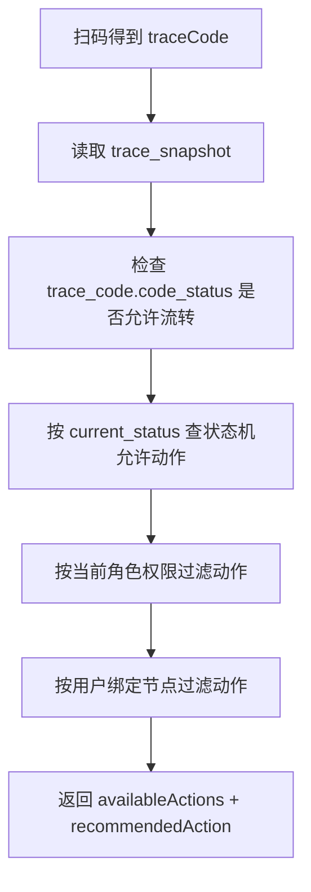

# 项目核心业务逻辑讲解：角色、节点、扫码与全国多节点测试设计（2026-05-10）

**适用场景**：用于和老师解释当前项目的真实业务模型、为什么要做“用户-节点绑定”、全国多节点下怎么理解测试账号，以及当前系统还有哪些“已实现 / 未完全接通”的边界。  
**基于当前代码与数据库**：`backend/sql/init_schema.sql`、`TraceTransitionPolicy`、`TraceActionPermissionPolicy`、`TraceUserNodeBindingServiceImpl`、`TraceAvailableActionService`、`TraceFlowTaskServiceImpl`、前端 Trace/Dashboard/Layout 页面，以及本地 `trace_db` 当前数据。

---

## 1. 先回答当前最困惑的问题

### 1.1 “全国那么大，每一个角色绑定一个节点”合理吗？

严格说，**当前项目不是“角色绑定节点”，而是“用户绑定节点”**。

- **角色 Role**：决定一个人能做什么类型的操作。比如：
  - `PRODUCER`：生产赋码、打印、激活。
  - `WAREHOUSE`：入库、出库、仓库任务扫码。
  - `LOGISTICS`：物流流转、物流任务扫码。
  - `SUPER_ADMIN / ADMIN`：系统管理、权限管理、数据管理。
- **节点 Node**：决定这个人“实际在哪个工厂、仓库、物流站、客户点”作业。
- **用户-节点绑定 User-Node Binding**：决定某个具体账号可以在哪些节点作业。

所以全国很大时，不是创建“北京仓库角色、上海仓库角色、广州仓库角色”，也不是“一个角色只能绑定一个节点”，而是：

```text
同一个 WAREHOUSE 角色
    ├─ warehouse_北京一号仓账号 → 绑定 北京一号仓
    ├─ warehouse_苏州中央仓账号 → 绑定 苏州中央仓
    ├─ warehouse_广州华南仓账号 → 绑定 广州华南仓
    └─ warehouse_成都仓账号     → 绑定 成都仓
```

也就是说：

> **角色负责“功能权限”，节点绑定负责“作业地点”。**

当前测试数据里看起来像“一个角色绑定一个节点”，是因为 demo seed 里只有一个 `producer`、一个 `warehouse`、一个 `logistics` 示例账号，所以简化成：

| 测试账号 | 角色 | 当前 demo 绑定节点 |
|---|---|---|
| `producer` | `PRODUCER` | 北京通用电气制造厂 |
| `warehouse` | `WAREHOUSE` | 苏州中央仓储 |
| `logistics` | `LOGISTICS` | 上海顺丰转运中心 |

这只是**演示种子数据的简化**，不是系统模型只能这样设计。

### 1.2 测试时这样合理吗？

分两种测试目标：

| 测试目标 | 是否合理 | 说明 |
|---|---|---|
| 验证权限模型、节点门禁是否严谨 | 合理 | 一个业务账号绑定一个节点，更接近真实工位：苏州仓人员不能冒充广州仓扫码。 |
| 答辩/演示时想用一个账号快速走完全流程 | 不方便 | 会频繁切账号，老师可能误以为 superadmin 什么都能扫。 |
| 全国多节点规模测试 | 当前 demo 不够 | 应该新增多个同角色账号，分别绑定不同省市节点，而不是继续用一个账号代表全国。 |

因此建议对老师这样解释：

> 当前 demo 里“一个业务账号绑定一个节点”是为了验证节点权限边界；全国规模下应扩展为“同一角色下有很多账号，每个账号绑定自己负责的节点”。如果只是答辩演示，可以额外准备一个 `demo_operator` 或给 `superadmin` 临时绑定全部节点，用来减少切账号，但这属于演示便利，不是生产模型。

---

## 2. 当前系统的三层核心模型

当前项目可以拆成三层来理解：

```text
第一层：码本身能不能用
  trace_code.code_status
  GENERATED / PRINTED / ACTIVATED / IN_STOCK / IN_TRANSIT / EXCEPTION / VOIDED / SCRAPPED

第二层：这件货现在处于什么物流生命周期
  trace_snapshot.current_status + trace_lifecycle_log
  INIT / IN_STOCK / IN_TRANSIT / TRANSFERRED / EXCEPTION

第三层：谁可以在哪里操作
  sys_role_permission + trace_user_node_binding + trace_node
  角色权限 + 用户绑定节点
```

这三层分别解决不同问题。

| 层 | 解决的问题 | 关键表/代码 |
|---|---|---|
| 码状态层 | 这个二维码标签是否已经打印、激活、作废，是否允许进入流转 | `trace_code`、`TraceCodeStatus`、`TraceCodeStatusService` |
| 生命周期层 | 这件货现在在哪里、处于在库/运输/异常等哪个业务状态 | `trace_snapshot`、`trace_lifecycle_log`、`TraceTransitionPolicy` |
| 作业权限层 | 当前账号是否有功能权限，并且是否在允许的物理节点作业 | `sys_role_permission`、`trace_node`、`trace_user_node_binding`、`TraceActionPermissionPolicy`、`TraceUserNodeBindingServiceImpl` |

---

## 3. 业务主数据：节点不是角色，节点是物理/业务地点

### 3.1 `trace_node` 表的含义

当前 schema 中 `trace_node` 是结构化业务节点表，表示全国范围内的真实作业点：

| 字段 | 含义 |
|---|---|
| `node_code` | 节点编码，例如 `NODE-WAREHOUSE-SZ` |
| `node_name` | 节点名称，例如 `苏州中央仓储` |
| `node_type` | 节点类型：`FACTORY / WAREHOUSE / LOGISTICS / CUSTOMER / SERVICE` |
| `province / city / address` | 节点所在地区 |
| `enabled` | 节点是否启用 |

当前 demo seed 中有 6 个节点：

| 节点编码 | 节点名 | 类型 | 地区 |
|---|---|---|---|
| `NODE-FACTORY-BJ` | 北京通用电气制造厂 | FACTORY | 北京/北京市 |
| `NODE-WAREHOUSE-SZ` | 苏州中央仓储 | WAREHOUSE | 江苏/苏州市 |
| `NODE-WAREHOUSE-GZ` | 广州华南仓储 | WAREHOUSE | 广东/广州市 |
| `NODE-LOGISTICS-SH` | 上海顺丰转运中心 | LOGISTICS | 上海/上海市 |
| `NODE-LOGISTICS-CD` | 成都德邦转运中心 | LOGISTICS | 四川/成都市 |
| `NODE-CUSTOMER-WH` | 武汉东风汽车整装厂 | CUSTOMER | 湖北/武汉市 |

### 3.2 `trace_user_node_binding` 表的含义

`trace_user_node_binding` 表是“某个具体用户能在哪些节点作业”。

当前字段核心含义：

| 字段 | 含义 |
|---|---|
| `user_id` | 用户 ID |
| `node_id` | 可操作节点 ID |
| `default_node` | 是否默认节点；当一个用户绑定多个节点时用于自动推断 |
| `enabled` | 绑定是否启用 |

这个表是系统全国化的关键：

- 一个用户可以绑定一个节点，也可以绑定多个节点。
- 一个节点可以绑定很多用户。
- 角色不需要随着节点数量爆炸。

例如全国 1000 个仓库，不应该创建 1000 个仓库角色；而应该是：

```text
角色：WAREHOUSE
节点：1000 个 WAREHOUSE 类型 trace_node
用户：每个仓库若干仓管账号
绑定：每个仓管账号绑定自己负责的仓库节点
```

---

## 4. 当前角色和权限设计

当前系统里角色权限来自 `sys_role_permission`，再由后端 `TraceActionPermissionPolicy` 映射到具体扫码动作。

### 4.1 当前内置角色

| 角色 | 当前定位 |
|---|---|
| `SUPER_ADMIN` | 超级管理员，拥有全部权限 |
| `ADMIN` | 管理员，当前也基本拥有管理和业务权限 |
| `PRODUCER` | 生产赋码、打印、激活、异常处理 |
| `WAREHOUSE` | 仓库入库、出库、流转任务创建/扫码/完成 |
| `LOGISTICS` | 物流流转、流转任务创建/扫码/完成 |
| `USER` | 只读查询用户 |

### 4.2 角色权限不是最终通行证

以扫码为例，光有角色权限还不够。系统还会检查节点绑定。

```text
是否能扫码动作 = 角色功能权限通过 AND 状态机允许 AND 码状态允许 AND 节点绑定通过
```

举例：

| 账号 | 有无功能权限 | 有无节点绑定 | 结果 |
|---|---|---|---|
| `superadmin` | 有全部扫码权限 | 当前 demo 无绑定 | 扫码登记动作为空 |
| `warehouse` | 有 `trace:inbound/outbound` | 绑定苏州仓 | 可以做符合节点规则的入库/出库 |
| `producer` | 有赋码/打印/激活 | 绑定北京工厂 | 不等于可以做入库，因为当前无 `trace:inbound` |

这就是为什么“权限最高”不等于“物理上可以在所有地点扫码”。

---

## 5. 为什么需要“节点绑定”这道门？

如果只看角色权限，会出现一个严重问题：全国范围内任何有仓库角色的人都可以冒充任意仓库操作。

例如：

```text
张三是苏州仓仓管员，角色是 WAREHOUSE。
如果系统只检查角色权限：
  张三可以在系统里填 fromNode=广州华南仓储，伪造广州仓出库。

加入节点绑定后：
  张三只绑定 NODE-WAREHOUSE-SZ。
  系统会拒绝他以广州仓身份执行出库/流转。
```

因此节点绑定不是多余设计，而是为了保证：

1. **谁在哪里操作是可信的**。
2. **物流链条中的节点不是随便手填伪造的**。
3. **全国多仓、多物流中心时，权限不会失控**。

可以把它解释成：

> 角色是“岗位职责”，节点绑定是“工位/网点归属”。岗位职责允许你做仓库业务，但只能在你绑定的仓库做。

---

## 6. 当前扫码动作是怎么被判断出来的？

当前前端扫码后会调用：

```text
GET /api/traces/{traceCode}/available-actions
```

后端会按下面顺序判断：



### 6.1 第一道：码状态是否允许流转

`trace_code.code_status` 表示二维码标签本身是否可用。

| code_status | 含义 | 是否允许常规流转 |
|---|---|---|
| `GENERATED` | 已生成但未打印/未激活 | 否 |
| `PRINTED` | 已打印但未贴码激活 | 否 |
| `ACTIVATED` | 已贴码并激活 | 是 |
| `IN_STOCK` | 已入库 | 是 |
| `IN_TRANSIT` | 运输中 | 是 |
| `EXCEPTION` | 异常冻结 | 常规流转否 |
| `VOIDED / SCRAPPED` | 作废/报废 | 否 |

所以当前系统不是“生成码后马上可以流转”，而是：

```text
生成码 GENERATED → 打印 PRINTED → 贴码扫码激活 ACTIVATED → 才允许入库/出库/流转
```

### 6.2 第二道：生命周期状态机

当前 `TraceTransitionPolicy` 定义的最小业务闭环是：

| 当前状态 | 允许动作 | 下一个状态 |
|---|---|---|
| `INIT` | `INBOUND` | `IN_STOCK` |
| `INIT` | `EXCEPTION_OPEN` | `EXCEPTION` |
| `IN_STOCK` | `OUTBOUND` | `IN_TRANSIT` |
| `IN_STOCK` | `EXCEPTION_OPEN` | `EXCEPTION` |
| `IN_TRANSIT` | `TRANSFER` | `TRANSFERRED` |
| `IN_TRANSIT` | `INBOUND` | `IN_STOCK` |
| `IN_TRANSIT` | `EXCEPTION_OPEN` | `EXCEPTION` |
| `TRANSFERRED` | `INBOUND` | `IN_STOCK` |
| `TRANSFERRED` | `EXCEPTION_OPEN` | `EXCEPTION` |
| `EXCEPTION` | `EXCEPTION_CLOSE` | 恢复冻结前状态 |

注意：当前状态机不是完整物流路线规划，它只是保证**状态不能乱跳**。

例如：

- 不能在 `INIT` 直接 `OUTBOUND`。
- 不能在 `IN_STOCK` 直接 `TRANSFER`。
- 异常冻结时，不能继续正常入库/出库/流转。

### 6.3 第三道：角色动作权限

`TraceActionPermissionPolicy` 将动作映射到权限：

| 动作 | 需要权限 |
|---|---|
| `INBOUND` | `trace:inbound` 或 `trace:scan` |
| `OUTBOUND` | `trace:outbound` 或 `trace:scan` |
| `TRANSFER` | `trace:transfer` 或 `trace:scan` |
| `PRINT_CODE / REPRINT_CODE / VOID_CODE` | `trace:code:print` |
| `ACTIVATE_CODE` | `trace:code:activate` |
| `EXCEPTION_OPEN / EXCEPTION_CLOSE / CORRECTION` | `trace:exception:handle` 或 `trace:scan` |

### 6.4 第四道：用户节点绑定

当前节点绑定的实际规则比较细：

#### INBOUND 入库

- 第一次从 `INIT` 入库时：当前节点通常是生产节点，入库目标是用户所在仓库。
- 所以可执行动作判断时，只要用户有任意绑定节点，就可以看到 `INBOUND`。
- 真正提交时，`toNode` 必须是用户绑定的节点；如果不传 `toNode`，后端会用用户唯一/默认绑定节点补齐。

#### OUTBOUND / TRANSFER / EXCEPTION_OPEN

- 这些动作通常要求操作人就在当前货物所在节点。
- 所以 `fromNode` 要匹配用户绑定节点；不传 `fromNode` 时后端可用默认/唯一绑定节点补齐。

#### IN_TRANSIT / TRANSFERRED 状态下的 INBOUND

- 这时 `currentNode` 通常代表货物到达的接收节点。
- 因此 available-actions 会要求用户绑定当前节点，避免别人替目标节点收货。

---

## 7. 当前扫码写入后会发生什么？

扫码提交最终会写两类数据：

### 7.1 追加一条不可篡改日志：`trace_lifecycle_log`

每一次业务动作都会生成一条生命周期日志，包含：

- `trace_code`
- `action_type`
- `from_node / to_node`
- `province / city`
- `event_time / ingest_time`
- `prev_hash / current_hash`
- `signature`
- `operator`

这张表是“历史事实账本”。

### 7.2 更新当前快照：`trace_snapshot`

`trace_snapshot` 保存当前状态，方便列表和查询：

- 当前状态：`current_status`
- 当前节点：`current_node`
- 当前持有方：`current_owner`
- 当前地区：`province / city`
- 最新日志 ID：`last_log_id`
- 最新链哈希：`last_hash`

所以：

```text
trace_lifecycle_log = 完整历史链
trace_snapshot      = 当前最新状态
```

---

## 8. 当前“生产赋码 → 打印 → 激活 → 入库/出库/流转”的实际闭环

### 8.1 生产赋码

入口：`生产赋码工作台` 或旧版 `CreateTraceDialog`。

当前逻辑：

1. 选择配件 SPU。
2. 输入生产数量，最多 500。
3. 选择或填写生产节点。
4. 后端生成 `trace_code`。
5. 同时写入：
   - `trace_assign_batch`
   - `trace_code`，初始 `GENERATED`
   - `trace_lifecycle_log`，动作 `INIT`
   - `trace_snapshot`，状态 `INIT`

### 8.2 打印标签

动作：`PRINT_CODE / REPRINT_CODE`

- 打印会更新 `trace_code.print_count`。
- 会追加生命周期日志，但通常不改变 `trace_snapshot.current_status`。

### 8.3 扫码激活

动作：`ACTIVATE_CODE`

- 激活后 `trace_code.code_status = ACTIVATED`。
- 从这一步开始，码才允许进入普通物流流转。

### 8.4 入库/出库/流转

普通扫码工位当前流程：

```text
扫码识别 traceCode
  → 调 available-actions
  → 前端展示可执行动作
  → 用户选择入库/出库/流转/异常
  → 弹窗填写节点、省市、时间、备注
  → POST /api/traces/{traceCode}/events
  → 后端校验状态机、权限、节点绑定、幂等
  → 写 lifecycle_log + 更新 snapshot/code_status
```

当前最大问题是：前端弹窗仍要求操作员手填 from/to/province/city，而后端其实已经能自动推断一部分字段。

---

## 9. 为什么当前扫码弹窗“全手填”会让人迷茫？

当前 `ScanFlowDialog` 的表单字段是：

- 来源节点 `fromNode`
- 目标节点 `toNode`
- 省份 `province`
- 城市 `city`
- 时间 `eventTime`
- 备注 `remark`

这会造成一种错觉：

> 好像系统不知道当前用户在哪，也不知道货物在哪，需要每次人工补全。

但实际后端已经有：

- 当前货物在哪里：`trace_snapshot.current_node`
- 当前用户可操作哪里：`trace_user_node_binding`
- 节点地区：`trace_node.province/city`

所以更合理的前端体验应该是：

| 字段 | 当前前端 | 当前后端能力 | 推荐体验 |
|---|---|---|---|
| `fromNode` | 手填 | 可由当前快照或用户节点推断 | 自动预填，必要时允许改 |
| `toNode` | 手填 | INBOUND 时可由用户默认/唯一绑定节点推断 | 自动预填 |
| `province/city` | 手选 | 可由绑定节点推断 | 自动填，默认只读 |
| `eventTime` | 默认当前时间 | 已支持 | 保持可改 |
| `remark` | 可选 | 已支持 | 保持可选 |

这也是二次复核里推荐优先修的原因。

---

## 10. 运单 / 流转任务模型当前是什么状态？

当前系统已经有运单/任务模型：

- `trace_flow_task`
- `trace_flow_task_scan`
- `TraceFlowTaskWorkbench.vue`
- `TraceFlowTaskServiceImpl`

它的目标是：

```text
先创建任务：
  source_node_id = 苏州仓
  target_node_id = 武汉客户
  expected_quantity = 50

再连续扫码：
  操作员只扫 traceCode
  系统按任务自动写 from/to/province/city/action
  actual_quantity 自动累计
```

当前任务工作台已经能做到“任务内扫码自动填节点”。

但是当前存在两个边界：

1. **本地数据库当前 `trace_flow_task = 0`**，所以没有可用于演示的开放任务。
2. **普通 ScanHub 尚未和 flow task 自动匹配**。也就是说，普通扫码工位扫码后不会自动问“这个码属于哪个开放运单”。

因此当前阶段应这样解释：

> 系统已经具备运单/任务工作台能力，但普通扫码工位仍是最小闭环；短期先做用户节点自动预填，中期再把普通扫码和运单上下文打通。

---

## 11. 当前测试码 `d6f99...` 为什么容易引发困惑？

本地数据库中该码当前情况：

| 项 | 当前值 |
|---|---|
| `trace_code.code_status` | `ACTIVATED` |
| `trace_snapshot.current_status` | `INIT` |
| `trace_snapshot.current_node` | `武汉东风汽车整装厂` |
| `trace_snapshot.province/city` | `湖北省 / 武汉市` |
| 最近日志 | `INIT → PRINT_CODE → ACTIVATE_CODE` |

它已经激活，所以可以进入流转；但它的 `current_status` 还是 `INIT`，所以状态机允许的常规动作只有 `INBOUND`。

不同账号扫码表现不同：

| 账号 | 为什么看到/看不到动作 |
|---|---|
| `superadmin` | 有权限但无节点绑定，节点门禁不通过，所以空 |
| `producer` | 有生产/打印/激活权限，但当前无 `trace:inbound`，所以不能入库 |
| `warehouse` | 有 `trace:inbound` 且有节点绑定，应能看到入库动作 |
| `logistics` | 有 `trace:transfer`，但 INIT 状态不允许 TRANSFER，所以空 |

这说明当前系统不是坏了，而是：

> 它在同时校验“码是否激活、状态能否流转、角色是否有动作权限、用户是否有节点绑定”。

---

## 12. 全国多节点下，推荐怎么设计测试账号？

### 12.1 生产真实性测试

用于证明权限模型严谨，推荐每个真实作业点一个或多个账号：

| 测试账号 | 角色 | 绑定节点 | 用途 |
|---|---|---|---|
| `producer_bj` | PRODUCER | 北京工厂 | 生产赋码、打印、激活 |
| `warehouse_sz` | WAREHOUSE | 苏州仓 | 苏州入库、出库 |
| `warehouse_gz` | WAREHOUSE | 广州仓 | 广州入库、出库 |
| `logistics_sh` | LOGISTICS | 上海转运 | 上海物流交接 |
| `logistics_cd` | LOGISTICS | 成都转运 | 成都物流交接 |
| `receiver_wh` | WAREHOUSE 或新增 RECEIVER | 武汉客户节点 | 终点收货/入库 |

当前系统没有单独的 `CUSTOMER_RECEIVER` 角色，所以如果要演示客户收货，有两个选择：

1. 临时用 `WAREHOUSE` 角色绑定客户节点，执行 `INBOUND`。
2. 后续新增一个更准确的 `RECEIVER / CUSTOMER_OPERATOR` 角色，只给 `trace:inbound` 和 `trace:view`。

### 12.2 答辩便捷演示

用于减少切账号，可以额外准备一个演示账号：

| 账号 | 角色 | 绑定节点 | 说明 |
|---|---|---|---|
| `demo_operator` | SUPER_ADMIN 或 WAREHOUSE/LOGISTICS 混合权限角色 | 全部 demo 节点 | 只用于演示，不代表生产权限模型 |

或者给 `superadmin` 临时绑定全部节点。

但讲解时要明确：

> 这是演示便利账号，不是生产推荐配置。生产环境下超管主要做系统管理，不应该默认代表所有物理网点作业。

### 12.3 自动化测试

自动化测试建议每个测试显式准备自己的节点和绑定，不依赖共享 demo 数据：

```text
测试用例 A：warehouse_sz 只能在苏州仓出库
测试用例 B：warehouse_sz 不能冒充广州仓出库
测试用例 C：logistics_sh 只能执行 TRANSFER，不能执行 INBOUND
测试用例 D：未激活码不能执行流转
测试用例 E：异常冻结后只能解除异常，不能普通出库
```

这样老师问“全国那么大怎么测试”时，可以回答：

> 我们不是拿一个账号代表全国，而是用节点表 + 用户节点绑定表构造不同省市、不同网点、不同角色的测试矩阵。

---

## 13. 当前设计中需要诚实说明的边界

### 13.1 普通扫码工位还没有完全接入运单

虽然系统已有 `trace_flow_task`，但普通 `ScanHub` 仍然不是“先选运单再扫码”的强任务模式。

当前是：

```text
普通扫码工位：扫码 → 判断动作 → 弹窗登记
任务工作台：选任务 → 连续扫码 → 自动累计
```

这两个路径当前并行存在，尚未完全合并。

### 13.2 中间路线不是自动规划出来的

当前系统可以记录多站流转：

```text
北京工厂 → 苏州仓 → 上海转运 → 武汉客户
```

但每一步需要由扫码事件或流转任务产生。系统目前没有完整的 `route_step` 路线规划表，也不会自动生成“下一站必须去哪里”的多段路线。

### 13.3 节点表是扁平节点，不是完整组织架构

`trace_node.org_id` 已预留，但当前组织层级没有完整展开。全国规模下可以继续演进为：

```text
集团 / 区域公司 / 省区 / 仓库 / 网点 / 工位
```

当前项目重点是节点作业权限和溯源链路，不是完整组织架构系统。

### 13.4 当前 demo seed 简化过度

当前 seed 只有一个 `producer`、一个 `warehouse`、一个 `logistics`，容易让人误解为“一个角色就是一个节点”。建议后续补充多账号、多节点 demo 数据。

---

## 14. 推荐和老师解释时使用的核心话术

### 14.1 一句话说明系统模型

> 本系统把“能做什么”和“能在哪里做”拆开：角色权限控制功能，用户节点绑定控制物理作业地点，扫码时再结合码状态和生命周期状态机判断当前是否可执行动作。

### 14.2 解释为什么 superadmin 不能直接扫

> 超管有功能权限，但当前 demo 没有给它绑定任何作业节点。系统故意把系统管理权限和现场作业地点分离，防止管理员账号在业务上冒充任意工厂或仓库。演示时可以给超管临时绑定节点，但生产模型不建议默认这样做。

### 14.3 解释全国规模

> 全国规模不是靠复制角色，而是靠节点表和用户-节点绑定表。比如全国 1000 个仓库仍然只有一个 WAREHOUSE 角色，具体哪个仓库由账号绑定的 trace_node 决定。

### 14.4 解释当前测试数据为什么简化

> 当前 demo seed 只放了一个生产账号、一个仓库账号、一个物流账号，用来证明最小业务闭环。它不是全国化最终样例。后续应该补多省、多仓、多账号的测试数据。

### 14.5 解释当前最应该修什么

> 当前最应该修的是扫码登记弹窗自动预填节点和省市，因为后端已经有快照当前节点、用户绑定节点和节点地区信息，前端不应再要求操作员每次手填。

---

## 15. 推荐后续改造顺序

| 优先级 | 改造 | 目的 |
|---|---|---|
| P0 | 修后端 WebMvc 白名单测试失败 | 保证工程测试绿灯 |
| P1 | ScanFlowDialog 自动预填 from/to/province/city | 解决最明显的扫码体验问题 |
| P1 | demo seed 补默认节点与多账号样例 | 让测试数据更符合“全国多节点”解释 |
| P2 | 增加 `receiver/customer_operator` 角色或明确用 WAREHOUSE 接收客户节点 | 补齐客户收货场景 |
| P2 | 普通 ScanHub 接入 flow task 上下文 | 让扫码工位真正运单化 |
| P3 | 增加 route_step / 多段路线规划 | 支持完整订单路线自动推下一站 |

---

## 16. 最终结论

当前项目的核心逻辑是合理的：

1. **角色权限**解决“能不能做这个功能”。
2. **用户节点绑定**解决“能不能在这个物理节点做”。
3. **码状态**解决“这个二维码是否已经激活、是否允许流转”。
4. **生命周期状态机**解决“当前状态下能不能执行这个动作”。
5. **哈希链和签名**解决“历史记录是否可信、不可篡改”。
6. **流转任务/运单**是后续把扫码从手工登记升级为任务驱动扫码的基础，但当前普通扫码工位还没完全接通。

所以，“一个业务测试账号绑定一个节点”在验证权限边界时是合理的；但如果用于答辩演示完整全国链路，当前 demo 数据太简化，应该补充多账号、多节点，或提供一个明确标注为演示用途的全节点账号。
